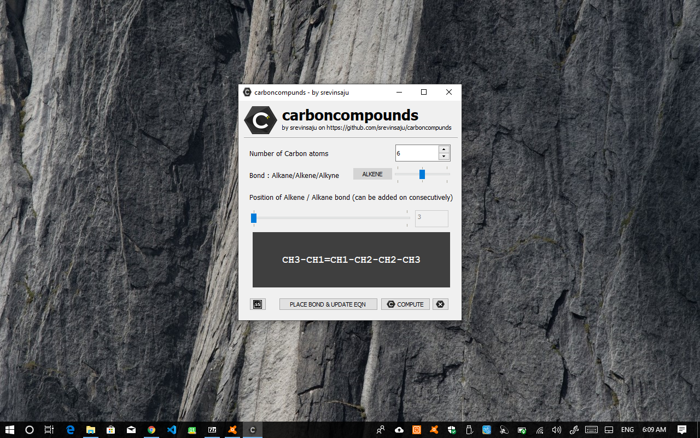

# carbonic

A simple python carbon engine which introduces as many bonds (single, double or triple) as required. **carbonic** algorithm checks for exception through gui and makes safe alteration to the structure.

## Why carbonic?
I chose the name 'carbonic' because, it is not about carbonic acids and other unrelated stuff but, instead, a small abbreviation for **CARBON** **I**n **C**ode.

## Installation

carbonic can be run directly from executable on Windows and Linux from Releases. For Mac OS, the software has to be built from source (as I don't have a Mac device).

### Steps to install:

1. (Also Step 0), Put a star on my github repo, it gives some self-confidence 😉

2. Go to [releases](https://github.com/srevinsaju/carbonic/releases), and download the latest release for your Operating System.

3. Run the Portable Executable file which runs offline, and Enjoy! 

## Building from Source

Building from Source is easy as pie with python3 as the coding language. Before you proceed, make sure you have python3 installed on your OS.

* Clone my github repo by: 
`git clone https://github.com/srevinsaju/carbonic.git`
* Type `cd carbonic`
* Install the dependencies by typing 

a) Windows: `pip install PyQt5` 

b) Linux or Mac: `pip3 install PyQt5`
* Run in terminal `python3 main.py` on Linux or Mac and `python main.py` on Windows.

## Future Releases:
* Add other functional groups support to Carbon Structure.
* Make AI more smarter. 😎🐱‍👤

## Contribute
Small AIs are made great with societal support. Pull Requests, Contributors and Issues help devleop great software from scratch. Your support is highly appreciated! 

## Changelog

###05082019 0924 GMT+530
* Added Transalator, to transalate normal IUPAC names to carbond bonds with length
* Extended UI to prevent glitches
* Added Carbonic logo .svg (licesnsed under Creative Commons License Attributions 4.0, made with Inkscape)
* Added groups like -methyl, -ethyl, -propyl groups to extend the carbonic engne support
* Added prefix numbers to place double/triple bonds. Prefix nmbers for alkane compunds are deprecated.

## License
    Copyright (C) 2019 Srevin Saju (srevinsaju)

    This program is free software: you can redistribute it and/or modify
    it under the terms of the GNU Affero General Public License as published
    by the Free Software Foundation v3, provided, the creator of this repository is proprly acknowledged.

    This program is distributed in the hope that it will be useful, but WITHOUT ANY WARRANTY; without even the implied warranty of MERCHANTABILITY or FITNESS FOR A PARTICULAR PURPOSE.  See the GNU Affero General Public License for more details.

    You should have received a copy of the GNU Affero General Public License
    along with this program.  If not, see <https://www.gnu.org/licenses/>.

Read [LICENSE](https://raw.githubusercontent.com/srevinsaju/carbonic/master/LICENSE) for detailed information. 

For more information to obtain legal license for commercial use, or non-acknowledged software, contact me on: 

Email : srevin03@gmail.com

## Copyright
    All code under the AGPL 3.0 License is copyrighted by the owner of the repo. Any individual is allowed to reuse the code provided, srevinsaju is acknowledged. Read LICENSE for more information

