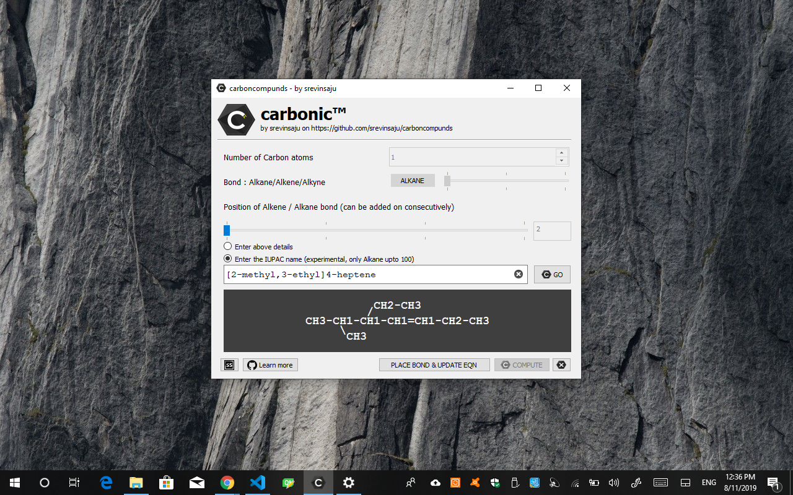
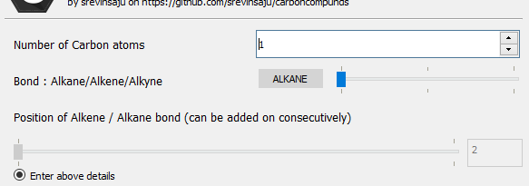
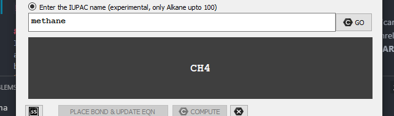
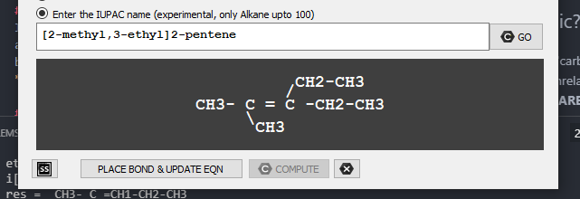

<html>
    <head>
        <meta name="google-site-verification" content="TEoM2-clv9NyZFINNVOiQPdGvn7Af7QASeVt29YFCzU" />
    </head>
</html>

# carbonic

A simple python carbon engine which introduces as many bonds (single, double or triple) as required. **carbonic** algorithm checks for exception through gui and makes safe alteration to the structure.

# How to use?

A] Option A: Enter the details to generate the Carbon bond structure
* In the first box Enter the number of Carbon Atoms. You can either increase the number with 
the arrows or enter the value manually.
* In the second box, move the slider to chose (i)alkane, (ii)alkene, (iii)alkyne. For the case
of alkene - alkyne bonds, you will get the chance to add on the position of the bond.
* Press the **COMPUTE** button to generate the skeleton or alkyne structure. For *alkyne* bond, this result produced in the *--OUTPUT--* box, is the final answer, for alkene-alkyne , the next step as to be folowed
* Next, choose the position of the new bond to be placed, with the slider. You can see the number 
changing in the small text box. It indicates the carbon compound on which, we would like to place the double/triple bonds. By default, the first atom, the second last and last atom are disabled, as Carbon bonds cannot be placed on Terminal atoms. You will notice that **PLACE BOND & UPDATE EQN** Button has been activated. Press this button to update the equation. You can repeat this step as many times as needed.
* Each time the **COMPUTE** button is pressed, the whole equation is resetted to the default structure.

B] Option B: Enter the IUPAC name of the carbon compound

* Select the RadioButton - 'Enter the IUPAC name..."

* In the textbox, you can enter the IUPAC name of the Carbon compound. For alkene-alkyne compounds, you can use *2-pentene* for a five atom carbon structure with double bond on second carbon atom. If you wish to add groups like *methyl, ethyl, propyl...*, you have to enter it within a square bracket, such as, *"[2-methyl, 3-ethyl]2-pentene"* to create a methyl group on second atom. 

* After typing the IUPAC name, hit the "GO" button to the right, and your equation is ready!

**NOTE**: Currently only two groups are recommended in the Square bracket, to prevent collisions. Will fix this shortly.

## Why carbonic?
I chose the name 'carbonic' because, it is not about carbonic acids and other unrelated stuff but, instead, a small abbreviation for **CARBON** **I**n **C**ode.

## Installation

carbonic can be run directly from executable on Windows and Linux from Releases. For Mac OS, the software has to be built from source (as I don't have a Mac device).

### Steps to install:

1. (Also Step 0), Put a star on my github repo, it gives some self-confidence 😉

2. Go to [releases](https://github.com/srevinsaju/carbonic/releases), and download the latest release for your Operating System.

3. Run the Portable Executable file which runs offline, and Enjoy! 

## Building from Source

Building from Source is easy as pie with python3 as the coding language. Before you proceed, make sure you have python3 installed on your OS.

* Clone my github repo by: 
`git clone https://github.com/srevinsaju/carbonic.git`
* Type `cd carbonic`
* Install the dependencies by typing 

a) Windows: `pip install PyQt5` 

b) Linux or Mac: `pip3 install PyQt5`
* Run in terminal `python3 main.py` on Linux or Mac and `python main.py` on Windows.

## Future Releases:
* Add other functional groups support to Carbon Structure.
* Make AI more smarter. 😎🐱‍👤

## Contribute
Small AIs are made great with societal support. Pull Requests, Contributors and Issues help devleop great software from scratch. Your support is highly appreciated! 

I am neither a chemistry university student nor a chemistry teacher. With the little knowledge of Grade 10 and Grade 11 Organic Chemistry, I have quite made it into a sheet. To be frank on my part, errors might have crept in. Please feel free to correct these errors, and to rectify my knowledge 😎.

## Changelog

### **v1.2** 05082019 0924 GMT+530
* Added Transalator, to transalate normal IUPAC names to carbond bonds with length
* Extended UI to prevent glitches
* Added Carbonic logo .svg (licesnsed under Creative Commons License Attributions 4.0, made with Inkscape)
* Added groups like -methyl, -ethyl, -propyl groups to extend the carbonic engne support
* Added prefix numbers to place double/triple bonds. Prefix nmbers for alkane compunds are deprecated.

## License
    Copyright (C) 2019 Srevin Saju (srevinsaju)

    This program is free software: you can redistribute it and/or modify
    it under the terms of the GNU Affero General Public License as published
    by the Free Software Foundation v3, provided, the creator of this repository is proprly acknowledged.

    This program is distributed in the hope that it will be useful, but WITHOUT ANY WARRANTY; without even the implied warranty of MERCHANTABILITY or FITNESS FOR A PARTICULAR PURPOSE.  See the GNU Affero General Public License for more details.

    You should have received a copy of the GNU Affero General Public License
    along with this program.  If not, see <https://www.gnu.org/licenses/>.

Read [LICENSE](https://raw.githubusercontent.com/srevinsaju/carbonic/master/LICENSE) for detailed information. 

For more information to obtain legal license for commercial use, or non-acknowledged software, contact me on: 

Email : srevin03@gmail.com

## Copyright
    All code under the AGPL 3.0 License is copyrighted by the owner of the repo. Any individual is allowed to reuse the code provided, srevinsaju is acknowledged. Read LICENSE for more information

    The logo of Carbonic is licensed under Creative Commons License Attributions 4.0. The modified work of carbonic is free to distribute provided all rights are acknowledged under AGPL 3.0

